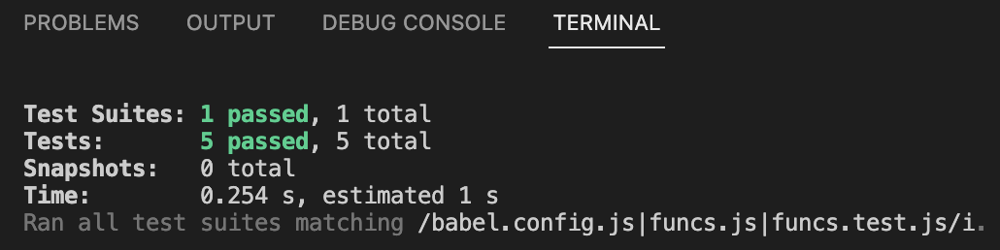

# Jest testing

Learning about testing & Test Driven Development (TDD) using Jest framework.

#### Preview

### Technologies Used

  &emsp;   &emsp; <a href="https://developer.mozilla.org/en-US/docs/Web/JavaScript" target="_blank" rel="noreferrer"> 